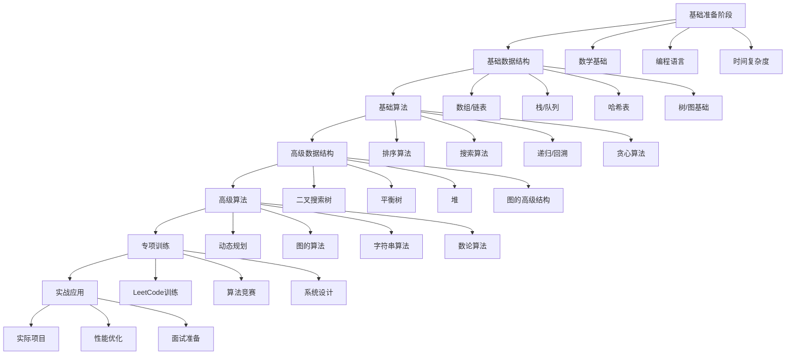

# 算法与数据结构学习路径：从零基础到算法大师的完整指南

掌握算法和数据结构是每个程序员成长的必经之路。无论是日常开发中的性能优化，还是技术面试中的算法题目，扎实的基础都是关键。本文将提供一个系统的学习路径，帮助你从零开始逐步掌握算法与数据结构。

## 学习路径概览

### 阶段划分



## 第一阶段：基础准备（2-3周）

### 1. 数学基础复习

**需要掌握的概念**：
```javascript
// 时间复杂度计算示例
function example(n) {
  // O(1) - 常数时间
  let x = 1

  // O(n) - 线性时间
  for (let i = 0; i < n; i++) {
    console.log(i)
  }

  // O(n²) - 平方时间
  for (let i = 0; i < n; i++) {
    for (let j = 0; j < n; j++) {
      console.log(i, j)
    }
  }
}

// 常见时间复杂度
// O(1) < O(log n) < O(n) < O(n log n) < O(n²) < O(n³) < O(2^n) < O(n!)
```

**对数运算**：
```javascript
// log₂(8) = 3 因为 2³ = 8
// log₁₀(100) = 2 因为 10² = 100
// 在算法中，默认log表示以2为底的对数

// 为什么二分查找是O(log n)？
// 每次查找都将搜索空间减半
// n -> n/2 -> n/4 -> ... -> 1
// 需要log₂n次操作
```

### 2. 编程语言准备

**JavaScript基础练习**：
```javascript
// 数组操作必须熟练
const arr = [1, 2, 3, 4, 5]

// 添加元素
arr.push(6)        // 尾部添加
arr.unshift(0)     // 头部添加
arr.splice(2, 0, 2.5) // 中间插入

// 删除元素
arr.pop()          // 尾部删除
arr.shift()        // 头部删除
arr.splice(2, 1)   // 删除指定位置

// 遍历数组
arr.forEach(item => console.log(item))
const doubled = arr.map(x => x * 2)
const evens = arr.filter(x => x % 2 === 0)
const sum = arr.reduce((acc, x) => acc + x, 0)

// 对象操作
const map = new Map()
map.set('key1', 'value1')
map.set('key2', 'value2')
console.log(map.get('key1'))
console.log(map.has('key1'))
map.delete('key1')

// Set操作
const set = new Set([1, 2, 3, 3, 4])
console.log(set) // Set {1, 2, 3, 4}
```

### 3. 开发环境搭建

```javascript
// 推荐的在线练习平台
const platforms = {
  leetcode: 'https://leetcode.com/',
  hackerRank: 'https://www.hackerrank.com/',
  codeforces: 'https://codeforces.com/',
  atcoder: 'https://atcoder.jp/'
}

// 本地开发环境
const setup = {
  editor: 'VS Code',
  extensions: [
    'LeetCode',      // 直接在VS Code刷题
    'Code Runner',   // 快速运行代码
    'JavaScript Debugger'
  ],
  node: 'Node.js 18+',
  debugger: 'Chrome DevTools 或 VS Code Debugger'
}
```

## 第二阶段：基础数据结构（4-5周）

### 1. 数组（Arrays）

**核心概念**：
```javascript
// 数组是最基础的数据结构
class MyArray {
  constructor() {
    this.data = {}
    this.length = 0
  }

  get(index) {
    return this.data[index]
  }

  push(item) {
    this.data[this.length] = item
    this.length++
    return this.length
  }

  pop() {
    const lastItem = this.data[this.length - 1]
    delete this.data[this.length - 1]
    this.length--
    return lastItem
  }

  delete(index) {
    const item = this.data[index]
    this.shiftItems(index)
    return item
  }

  shiftItems(index) {
    for (let i = index; i < this.length - 1; i++) {
      this.data[i] = this.data[i + 1]
    }
    delete this.data[this.length - 1]
    this.length--
  }
}
```

**常见数组算法**：
```javascript
// 两数之和
function twoSum(nums, target) {
  const map = new Map()

  for (let i = 0; i < nums.length; i++) {
    const complement = target - nums[i]

    if (map.has(complement)) {
      return [map.get(complement), i]
    }

    map.set(nums[i], i)
  }

  return []
}

// 最大子数组和
function maxSubArray(nums) {
  let maxSoFar = -Infinity
  let currentMax = 0

  for (let num of nums) {
    currentMax = Math.max(num, currentMax + num)
    maxSoFar = Math.max(maxSoFar, currentMax)
  }

  return maxSoFar
}
```

### 2. 链表（Linked Lists）

**基础实现**：
```javascript
class ListNode {
  constructor(val, next = null) {
    this.val = val
    this.next = next
  }
}

class LinkedList {
  constructor() {
    this.head = null
    this.size = 0
  }

  // 在头部添加节点
  prepend(val) {
    const newNode = new ListNode(val, this.head)
    this.head = newNode
    this.size++
  }

  // 在尾部添加节点
  append(val) {
    const newNode = new ListNode(val)

    if (!this.head) {
      this.head = newNode
    } else {
      let current = this.head
      while (current.next) {
        current = current.next
      }
      current.next = newNode
    }

    this.size++
  }

  // 删除指定值的节点
  delete(val) {
    if (!this.head) return

    if (this.head.val === val) {
      this.head = this.head.next
      this.size--
      return
    }

    let current = this.head
    while (current.next && current.next.val !== val) {
      current = current.next
    }

    if (current.next) {
      current.next = current.next.next
      this.size--
    }
  }
}

// 反转链表
function reverseList(head) {
  let prev = null
  let current = head

  while (current) {
    const next = current.next
    current.next = prev
    prev = current
    current = next
  }

  return prev
}

// 检测环
function hasCycle(head) {
  let slow = head
  let fast = head

  while (fast && fast.next) {
    slow = slow.next
    fast = fast.next.next

    if (slow === fast) {
      return true
    }
  }

  return false
}
```

### 3. 栈和队列（Stacks & Queues）

**栈的实现**：
```javascript
class Stack {
  constructor() {
    this.items = []
  }

  push(item) {
    this.items.push(item)
  }

  pop() {
    return this.items.pop()
  }

  peek() {
    return this.items[this.items.length - 1]
  }

  isEmpty() {
    return this.items.length === 0
  }

  size() {
    return this.items.length
  }
}

// 有效括号检查
function isValidParentheses(s) {
  const stack = []
  const pairs = { '(': ')', '[': ']', '{': '}' }

  for (let char of s) {
    if (pairs[char]) {
      stack.push(char)
    } else {
      const top = stack.pop()
      if (pairs[top] !== char) {
        return false
      }
    }
  }

  return stack.length === 0
}

// 队列的实现
class Queue {
  constructor() {
    this.items = []
  }

  enqueue(item) {
    this.items.push(item)
  }

  dequeue() {
    return this.items.shift()
  }

  front() {
    return this.items[0]
  }

  isEmpty() {
    return this.items.length === 0
  }
}

// 用两个栈实现队列
class QueueWithStacks {
  constructor() {
    this.stack1 = []
    this.stack2 = []
  }

  enqueue(x) {
    this.stack1.push(x)
  }

  dequeue() {
    if (this.stack2.length === 0) {
      while (this.stack1.length > 0) {
        this.stack2.push(this.stack1.pop())
      }
    }

    return this.stack2.pop()
  }
}
```

### 4. 哈希表（Hash Tables）

**基础实现**：
```javascript
class HashTable {
  constructor(size = 53) {
    this.keyMap = new Array(size)
  }

  _hash(key) {
    let total = 0
    let WEIRD_PRIME = 31

    for (let i = 0; i < Math.min(key.length, 100); i++) {
      let char = key[i]
      let value = char.charCodeAt(0) - 96
      total = (total * WEIRD_PRIME + value) % this.keyMap.length
    }

    return total
  }

  set(key, value) {
    const index = this._hash(key)

    if (!this.keyMap[index]) {
      this.keyMap[index] = []
    }

    // 检查是否已存在相同的key
    for (let i = 0; i < this.keyMap[index].length; i++) {
      if (this.keyMap[index][i][0] === key) {
        this.keyMap[index][i][1] = value
        return
      }
    }

    this.keyMap[index].push([key, value])
  }

  get(key) {
    const index = this._hash(key)

    if (this.keyMap[index]) {
      for (let i = 0; i < this.keyMap[index].length; i++) {
        if (this.keyMap[index][i][0] === key) {
          return this.keyMap[index][i][1]
        }
      }
    }

    return undefined
  }
}

// 两数之和（使用哈希表）
function twoSum(nums, target) {
  const map = new Map()

  for (let i = 0; i < nums.length; i++) {
    const complement = target - nums[i]

    if (map.has(complement)) {
      return [map.get(complement), i]
    }

    map.set(nums[i], i)
  }

  return []
}
```

## 第三阶段：基础算法（4-5周）

### 1. 排序算法

**快速排序**：
```javascript
function quickSort(arr) {
  if (arr.length <= 1) return arr

  const pivot = arr[Math.floor(arr.length / 2)]
  const left = []
  const right = []
  const equal = []

  for (let element of arr) {
    if (element < pivot) {
      left.push(element)
    } else if (element > pivot) {
      right.push(element)
    } else {
      equal.push(element)
    }
  }

  return [...quickSort(left), ...equal, ...quickSort(right)]
}

// 归并排序
function mergeSort(arr) {
  if (arr.length <= 1) return arr

  const middle = Math.floor(arr.length / 2)
  const left = arr.slice(0, middle)
  const right = arr.slice(middle)

  return merge(mergeSort(left), mergeSort(right))
}

function merge(left, right) {
  const result = []
  let leftIndex = 0
  let rightIndex = 0

  while (leftIndex < left.length && rightIndex < right.length) {
    if (left[leftIndex] < right[rightIndex]) {
      result.push(left[leftIndex])
      leftIndex++
    } else {
      result.push(right[rightIndex])
      rightIndex++
    }
  }

  return result.concat(left.slice(leftIndex)).concat(right.slice(rightIndex))
}
```

### 2. 搜索算法

**二分查找**：
```javascript
function binarySearch(arr, target) {
  let left = 0
  let right = arr.length - 1

  while (left <= right) {
    const mid = Math.floor((left + right) / 2)

    if (arr[mid] === target) {
      return mid
    } else if (arr[mid] < target) {
      left = mid + 1
    } else {
      right = mid - 1
    }
  }

  return -1
}

// 深度优先搜索（DFS）
function dfs(graph, start, visited = new Set()) {
  visited.add(start)
  console.log(start)

  for (let neighbor of graph[start]) {
    if (!visited.has(neighbor)) {
      dfs(graph, neighbor, visited)
    }
  }
}

// 广度优先搜索（BFS）
function bfs(graph, start) {
  const visited = new Set()
  const queue = [start]
  visited.add(start)

  while (queue.length > 0) {
    const vertex = queue.shift()
    console.log(vertex)

    for (let neighbor of graph[vertex]) {
      if (!visited.has(neighbor)) {
        visited.add(neighbor)
        queue.push(neighbor)
      }
    }
  }
}
```

### 3. 递归和回溯

**递归基础**：
```javascript
// 阶乘
function factorial(n) {
  if (n === 0 || n === 1) return 1
  return n * factorial(n - 1)
}

// 斐波那契数列
function fibonacci(n, memo = {}) {
  if (n in memo) return memo[n]
  if (n <= 1) return n

  memo[n] = fibonacci(n - 1, memo) + fibonacci(n - 2, memo)
  return memo[n]
}

// 全排列
function permutations(nums) {
  const result = []

  function backtrack(current, remaining) {
    if (current.length === nums.length) {
      result.push([...current])
      return
    }

    for (let i = 0; i < remaining.length; i++) {
      current.push(remaining[i])
      backtrack(current, remaining.slice(0, i).concat(remaining.slice(i + 1)))
      current.pop()
    }
  }

  backtrack([], nums)
  return result
}

// N皇后问题
function solveNQueens(n) {
  const result = []
  const board = Array(n).fill().map(() => Array(n).fill('.'))

  function isValid(row, col) {
    // 检查列
    for (let i = 0; i < row; i++) {
      if (board[i][col] === 'Q') return false
    }

    // 检查对角线
    for (let i = 0; i < row; i++) {
      const diff = Math.abs(row - i)
      if (col - diff >= 0 && board[i][col - diff] === 'Q') return false
      if (col + diff < n && board[i][col + diff] === 'Q') return false
    }

    return true
  }

  function backtrack(row) {
    if (row === n) {
      result.push(board.map(row => row.join('')))
      return
    }

    for (let col = 0; col < n; col++) {
      if (isValid(row, col)) {
        board[row][col] = 'Q'
        backtrack(row + 1)
        board[row][col] = '.'
      }
    }
  }

  backtrack(0)
  return result
}
```

## 第四阶段：高级数据结构（3-4周）

### 1. 二叉搜索树

```javascript
class TreeNode {
  constructor(val, left = null, right = null) {
    this.val = val
    this.left = left
    this.right = right
  }
}

class BinarySearchTree {
  constructor() {
    this.root = null
  }

  insert(val) {
    const newNode = new TreeNode(val)

    if (!this.root) {
      this.root = newNode
      return
    }

    let current = this.root
    while (true) {
      if (val < current.val) {
        if (!current.left) {
          current.left = newNode
          return
        }
        current = current.left
      } else {
        if (!current.right) {
          current.right = newNode
          return
        }
        current = current.right
      }
    }
  }

  search(val) {
    let current = this.root

    while (current) {
      if (val === current.val) return current
      if (val < current.val) {
        current = current.left
      } else {
        current = current.right
      }
    }

    return null
  }

  delete(val) {
    this.root = this.deleteNode(this.root, val)
  }

  deleteNode(node, val) {
    if (!node) return null

    if (val < node.val) {
      node.left = this.deleteNode(node.left, val)
    } else if (val > node.val) {
      node.right = this.deleteNode(node.right, val)
    } else {
      // 删除节点
      if (!node.left) return node.right
      if (!node.right) return node.left

      // 找到右子树的最小值
      let minRight = node.right
      while (minRight.left) {
        minRight = minRight.left
      }

      node.val = minRight.val
      node.right = this.deleteNode(node.right, minRight.val)
    }

    return node
  }
}

// 中序遍历
function inorderTraversal(root) {
  const result = []

  function traverse(node) {
    if (!node) return

    traverse(node.left)
    result.push(node.val)
    traverse(node.right)
  }

  traverse(root)
  return result
}
```

### 2. 堆（Heap）

```javascript
class MaxHeap {
  constructor() {
    this.heap = []
  }

  insert(val) {
    this.heap.push(val)
    this.bubbleUp()
  }

  bubbleUp() {
    let index = this.heap.length - 1

    while (index > 0) {
      const parentIndex = Math.floor((index - 1) / 2)

      if (this.heap[parentIndex] < this.heap[index]) {
        [this.heap[parentIndex], this.heap[index]] =
        [this.heap[index], this.heap[parentIndex]]
        index = parentIndex
      } else {
        break
      }
    }
  }

  extractMax() {
    const max = this.heap[0]
    const end = this.heap.pop()

    if (this.heap.length > 0) {
      this.heap[0] = end
      this.sinkDown()
    }

    return max
  }

  sinkDown() {
    let index = 0
    const length = this.heap.length

    while (true) {
      const leftChildIndex = 2 * index + 1
      const rightChildIndex = 2 * index + 2
      let swapIndex = null

      if (leftChildIndex < length) {
        if (this.heap[leftChildIndex] > this.heap[index]) {
          swapIndex = leftChildIndex
        }
      }

      if (rightChildIndex < length) {
        if (
          (swapIndex === null && this.heap[rightChildIndex] > this.heap[index]) ||
          (swapIndex !== null && this.heap[rightChildIndex] > this.heap[leftChildIndex])
        ) {
          swapIndex = rightChildIndex
        }
      }

      if (swapIndex === null) break

      [this.heap[index], this.heap[swapIndex]] =
      [this.heap[swapIndex], this.heap[index]]
      index = swapIndex
    }
  }
}

// 寻找数组中第K大的元素
function findKthLargest(nums, k) {
  const heap = new MaxHeap()

  for (let num of nums) {
    heap.insert(num)
  }

  for (let i = 0; i < k - 1; i++) {
    heap.extractMax()
  }

  return heap.extractMax()
}
```

## 第五阶段：高级算法（5-6周）

### 1. 动态规划

**基础概念**：
```javascript
// 斐波那契数列（DP实现）
function fibonacciDP(n) {
  if (n <= 1) return n

  const dp = [0, 1]

  for (let i = 2; i <= n; i++) {
    dp[i] = dp[i - 1] + dp[i - 2]
  }

  return dp[n]
}

// 空间优化版本
function fibonacciOptimized(n) {
  if (n <= 1) return n

  let prev = 0
  let curr = 1

  for (let i = 2; i <= n; i++) {
    const next = prev + curr
    prev = curr
    curr = next
  }

  return curr
}

// 爬楼梯问题
function climbStairs(n) {
  if (n <= 2) return n

  const dp = new Array(n + 1)
  dp[1] = 1
  dp[2] = 2

  for (let i = 3; i <= n; i++) {
    dp[i] = dp[i - 1] + dp[i - 2]
  }

  return dp[n]
}

// 背包问题（0-1背包）
function knapsack(weights, values, capacity) {
  const n = weights.length
  const dp = Array(n + 1).fill().map(() => Array(capacity + 1).fill(0))

  for (let i = 1; i <= n; i++) {
    for (let j = 1; j <= capacity; j++) {
      if (weights[i - 1] > j) {
        dp[i][j] = dp[i - 1][j]
      } else {
        dp[i][j] = Math.max(
          dp[i - 1][j],
          dp[i - 1][j - weights[i - 1]] + values[i - 1]
        )
      }
    }
  }

  return dp[n][capacity]
}

// 最长递增子序列
function lengthOfLIS(nums) {
  if (nums.length === 0) return 0

  const dp = new Array(nums.length).fill(1)

  for (let i = 1; i < nums.length; i++) {
    for (let j = 0; j < i; j++) {
      if (nums[i] > nums[j]) {
        dp[i] = Math.max(dp[i], dp[j] + 1)
      }
    }
  }

  return Math.max(...dp)
}
```

### 2. 图算法

**最短路径算法**：
```javascript
// Dijkstra算法
function dijkstra(graph, start) {
  const distances = {}
  const visited = new Set()
  const pq = new PriorityQueue()

  // 初始化距离
  for (let vertex in graph) {
    distances[vertex] = vertex === start ? 0 : Infinity
    pq.enqueue(vertex, distances[vertex])
  }

  while (!pq.isEmpty()) {
    const { element: vertex } = pq.dequeue()

    if (visited.has(vertex)) continue
    visited.add(vertex)

    for (let neighbor in graph[vertex]) {
      const distance = graph[vertex][neighbor]
      const newDistance = distances[vertex] + distance

      if (newDistance < distances[neighbor]) {
        distances[neighbor] = newDistance
        pq.enqueue(neighbor, newDistance)
      }
    }
  }

  return distances
}

// Floyd-Warshall算法
function floydWarshall(graph) {
  const n = graph.length
  const dist = graph.map(row => [...row])

  for (let k = 0; k < n; k++) {
    for (let i = 0; i < n; i++) {
      for (let j = 0; j < n; j++) {
        if (dist[i][k] + dist[k][j] < dist[i][j]) {
          dist[i][j] = dist[i][k] + dist[k][j]
        }
      }
    }
  }

  return dist
}

// 最小生成树（Prim算法）
function primMST(graph) {
  const n = graph.length
  const visited = new Set()
  const minEdge = new Array(n).fill(Infinity)
  const parent = new Array(n).fill(-1)

  minEdge[0] = 0

  for (let count = 0; count < n - 1; count++) {
    // 找到未访问的顶点中最小边
    let u = -1
    let min = Infinity

    for (let v = 0; v < n; v++) {
      if (!visited.has(v) && minEdge[v] < min) {
        min = minEdge[v]
        u = v
      }
    }

    visited.add(u)

    // 更新邻接顶点的最小边
    for (let v = 0; v < n; v++) {
      if (graph[u][v] && !visited.has(v) && graph[u][v] < minEdge[v]) {
        minEdge[v] = graph[u][v]
        parent[v] = u
      }
    }
  }

  return parent
}
```

## 第六阶段：专项训练（4-6周）

### 1. LeetCode训练计划

**按难度分类**：
```javascript
// Easy题目（建立信心）
const easyProblems = [
  'Two Sum',           // 数组，哈希表
  'Reverse Integer',   // 数学
  'Palindrome Number', // 字符串
  'Valid Parentheses', // 栈
  'Merge Two Sorted Lists', // 链表
  'Maximum Subarray',  // 数组，动态规划
  'Climbing Stairs',   // 动态规划
  'Best Time to Buy and Sell Stock' // 数组
]

// Medium题目（核心练习）
const mediumProblems = [
  'Add Two Numbers',          // 链表
  'Longest Substring Without Repeating Characters', // 滑动窗口
  'Valid Parentheses',        // 栈
  'Merge K Sorted Lists',     // 堆
  'Valid Sudoku',             // 矩阵
  'Implement Trie (Prefix Tree)', // 字典树
  'Coin Change',              // 动态规划
  'House Robber II',          // 动态规划
  'Unique Paths',             // 动态规划
  'Jump Game'                 // 贪心算法
]

// Hard题目（挑战极限）
const hardProblems = [
  'Median of Two Sorted Arrays', // 二分查找
  'Regular Expression Matching', // 动态规划
  'Merge K Sorted Lists',       // 堆
  'Reverse Nodes in k-Group',    // 链表
  'Subsets',                    // 回溯
  'Word Break',                 // 动态规划
  'Binary Tree Maximum Path Sum', // 树，递归
  'Longest Valid Parentheses',   // 栈，动态规划
  'Best Time to Buy and Sell Stock III', // 动态规划
  'Copy List with Random Pointer' // 链表
]
```

### 2. 算法模式总结

**双指针技巧**：
```javascript
// 两数之和（有序数组）
function twoSumSorted(nums, target) {
  let left = 0
  let right = nums.length - 1

  while (left < right) {
    const sum = nums[left] + nums[right]

    if (sum === target) {
      return [left + 1, right + 1]
    } else if (sum < target) {
      left++
    } else {
      right--
    }
  }

  return []
}

// 移除零
function moveZeroes(nums) {
  let lastNonZeroFoundAt = 0

  for (let i = 0; i < nums.length; i++) {
    if (nums[i] !== 0) {
      [nums[lastNonZeroFoundAt], nums[i]] = [nums[i], nums[lastNonZeroFoundAt]]
      lastNonZeroFoundAt++
    }
  }
}

// 滑动窗口
function minWindow(s, t) {
  const need = new Map()
  const window = new Map()

  for (let char of t) {
    need.set(char, (need.get(char) || 0) + 1)
  }

  let left = 0
  let right = 0
  let valid = 0
  let start = 0
  let len = Infinity

  while (right < s.length) {
    const c = s[right]
    right++

    if (need.has(c)) {
      window.set(c, (window.get(c) || 0) + 1)
      if (window.get(c) === need.get(c)) {
        valid++
      }
    }

    while (valid === need.size) {
      if (right - left < len) {
        start = left
        len = right - left
      }

      const d = s[left]
      left++

      if (need.has(d)) {
        if (window.get(d) === need.get(d)) {
          valid--
        }
        window.set(d, window.get(d) - 1)
      }
    }
  }

  return len === Infinity ? "" : s.slice(start, start + len)
}
```

## 学习建议和资源

### 1. 学习计划模板

```javascript
// 每周学习计划示例
const weeklyPlan = {
  monday: {
    topic: '新的数据结构',
    tasks: [
      '阅读理论1小时',
      '实现代码2小时',
      '练习题3道'
    ]
  },
  tuesday: {
    topic: '复习昨天的内容',
    tasks: [
      '重写实现1小时',
      '做5道相关题目'
    ]
  },
  wednesday: {
    topic: '新的算法',
    tasks: [
      '理解算法思想1小时',
      '手动推演过程1小时',
      '代码实现2小时'
    ]
  },
  thursday: {
    topic: '算法练习',
    tasks: [
      '简单题目5道',
      '中等题目3道'
    ]
  },
  friday: {
    topic: '综合练习',
    tasks: [
      '完成1道困难题目',
      '总结本周内容'
    ]
  },
  weekend: {
    topic: '复习和拓展',
    tasks: [
      '重做本周错题',
      '阅读相关博客',
      '参加算法竞赛'
    ]
  }
}
```

### 2. 推荐资源

```javascript
const resources = {
  books: [
    {
      title: '算法导论',
      difficulty: '高级',
      description: '算法领域的经典教材'
    },
    {
      title: 'JavaScript算法与数据结构',
      difficulty: '中级',
      description: '使用JavaScript实现的算法教程'
    },
    {
      title: '编程珠玑',
      difficulty: '中级',
      description: '通过实际问题学习算法'
    }
  ],
  websites: [
    {
      name: 'LeetCode',
      url: 'https://leetcode.com/',
      description: '算法练习平台'
    },
    {
      name: 'VisuAlgo',
      url: 'https://visualgo.net/en',
      description: '算法可视化工具'
    },
    {
      name: 'GeeksforGeeks',
      url: 'https://www.geeksforgeeks.org/',
      description: '算法教程和练习'
    }
  ],
  channels: [
    {
      name: 'MIT OpenCourseWare',
      url: 'https://ocw.mit.edu/courses/electrical-engineering-and-computer-science/',
      description: 'MIT免费算法课程'
    },
    {
      name: 'Abdul Bari',
      url: 'https://www.youtube.com/channel/UCZCFT11CWBi3MHNlGf019nw',
      description: '算法教学视频'
    }
  ]
}
```

## 面试准备建议

### 1. 常见面试题型

```javascript
// 必会算法列表
const mustKnowAlgorithms = [
  '排序算法',  // 快速排序，归并排序，堆排序
  '搜索算法',  // 二分查找，DFS，BFS
  '动态规划',  // 背包问题，最长子序列，编辑距离
  '图算法',    // 最短路径，最小生成树，拓扑排序
  '树算法',    // 二叉搜索树，遍历，最近公共祖先
  '字符串',    // KMP，正则表达式，编码解码
  '数组操作',  // 双指针，滑动窗口，矩阵操作
  '链表操作',  // 反转，合并，环检测
  '位运算',    // 常见位操作技巧
  '数学问题'   // 质数，最大公约数，组合数学
]
```

### 2. 面试技巧

```javascript
// 问题解决框架
const problemSolvingFramework = {
  step1: '理解问题，澄清需求',
  step2: '分析约束和边界条件',
  step3: '考虑多种解决方案',
  step4: '选择最优方案并说明理由',
  step5: '实现代码，注意边界情况',
  step6: '测试用例验证',
  step7: '分析时间和空间复杂度',
  step8: '讨论可能的优化方案'
}

// 代码模板
const codingTemplate = `
function solution(input) {
  // 1. 理解问题和约束
  const constraints = {
    // 输入范围
    // 时间复杂度要求
    // 空间复杂度要求
  }

  // 2. 边界情况处理
  if (/* 边界条件 */) {
    return /* 边界情况结果 */
  }

  // 3. 核心算法实现
  let result = /* 初始化结果 */

  // 算法逻辑
  // ...

  // 4. 返回结果
  return result
}

// 测试用例
function testSolution() {
  const testCases = [
    // 正常情况
    { input: /* 测试输入 */, expected: /* 期望输出 */ },
    // 边界情况
    { input: /* 边界输入 */, expected: /* 边界输出 */ },
    // 异常情况
    { input: /* 异常输入 */, expected: /* 异常输出 */ }
  ]

  testCases.forEach(({ input, expected }) => {
    const result = solution(input)
    console.log('Input:', input)
    console.log('Expected:', expected)
    console.log('Actual:', result)
    console.log('Pass:', result === expected)
    console.log('---')
  })
}
`
```

## 总结

算法与数据结构的学习是一个循序渐进的过程，需要：

1. **扎实的基础**：理解基本概念和时间复杂度分析
2. **大量练习**：通过刷题巩固知识，培养算法思维
3. **总结归纳**：整理常见的解题模式和技巧
4. **持续学习**：跟进新的算法和技术发展
5. **实际应用**：在项目中运用所学知识

记住，算法能力的提升需要时间和耐心。制定合理的学习计划，坚持练习，逐步提升。不要急于求成，重要的是理解算法背后的思想，而不是死记硬背代码。

通过系统的学习和持续的练习，你一定能够掌握算法与数据结构，成为优秀的程序员。

---
